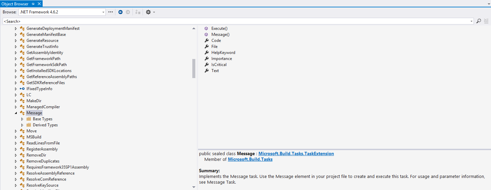

# MSBUILD 


# Introduction & Basics

The Microsoft Build Engine (MSBuild) is the build platform for .NET and Visual Studio. It is free and open-source [GitHub :link:](https://github.com/Microsoft/msbuild). MSBuild handles all kinds of tasks related with build operation. Visual Studio uses MSBuild, but MSBuild does not depend on Visual Studio.

As a dot.net developer it gets benefit to know MSBUild. In deed its an interpreted programming language expressed as in XML. MSBuild XML file interpreted by MSBuild.exe. If dot.net framework installed MSBuild.exe comes with it. Can be invoked by command line and also with Visual Studio (F5, CTRL + F5), and also inside TFS.

Beside those;

* MSBuid capabilities can be extend beside building and executing related tasks.

* Can be used as a general purpose automation tool.

## Hello World! :earth_africa:

Root element for an msbuild file must be *Project* and xml namesspace is *http://schemas.microsoft.com/developer/msbuild/2003*   

MSBuild File: [hello-world.msbuild](https://github.com/karanba/MSBuild-Workspace/blob/01-Basics/src/hello-world.msbuild)
```xml
<?xml version="1.0" encoding="utf-8"?>
<Project xmlns="http://schemas.microsoft.com/developer/msbuild/2003">
    <Target Name="hello-world">
        <Message Text="Hello, World!" />
    </Target>
</Project>
```

:runner: _to run this file_; 

```powershell
msbuild .\src\hello-world.msbuild
```
:scroll: _output:_

```powershell

Project "C:\repo\GitHub\MSBuild-Workspace\src\hello-world.msbuild" on node 1 (default targets).
HelloWorld:
  Hello, World!
Done Building Project "C:\repo\GitHub\MSBuild-Workspace\src\hello-world.msbuild" (default targets).


Build succeeded.
    0 Warning(s)
    0 Error(s)
```

## Where is MSBuild.exe :mag: 

Inside .net framework folder;
```powershell
C:\Windows\Microsoft.NET\Framework\v4.0.30319\MSBuild.exe
```
Also _msbuild.exe.config_,  _MSBuild.rsp_ file and _MSBuild_ folder is there which holds _xsd_ files that define the structure inside msbuild xml file.

``` bash
 MSBUild /
 ---- Microsoft.Build.Commontypes.xsd
 ---- Microsoft.Build.Core.xsd
```

Inside Visual Studio Installation folder;
```powershell
TODO: Add Path
```

## Targets

There can be multiple targets on an MSBuild file. If there is more than one task first one will be run. It can be changed by passing the parameter _/target: \<target name\>_ or like _/t: \<target name\>_

```powershell
msbuild .\src\targets.msbuild /target:OtherTask
```

Also we can use _DefaultTargets_ attribute for _Project_ element like below;

MSBuild File: [targets.msbuild](https://github.com/karanba/MSBuild-Workspace/blob/01-Basics/src/targets.msbuild)
```xml
<?xml version="1.0" encoding="utf-8"?>
<Project DefaultTargets="OtherTask" xmlns="http://schemas.microsoft.com/developer/msbuild/2003">
    <Target Name="HelloWorld">
        <Message Text="Hello, World!" />
    </Target>
    <Target Name="OtherTask">
        <Message Text="Do smth else" />
    </Target>
</Project>
```
If you both have  _DefaultTargets_ atrribute inside file ans alos use _/target:\<Task Name\>_ together, command line parameter will ovewrite _DefaultTargets_ attribute.


## Response (RSP) Files

One think you'll find using MSBuild you'are going to end up needing to use lots of command line arguments. RSP is a handy way of giving command line arguments.

Response File: [targets.rsp](https://github.com/karanba/MSBuild-Workspace/blob/01-Basics/src/targets.rsp)
```bash
/target:OtherTask
```

To run MSBuild with .rsp file we can use following syntax

```powershell
MSBuild.exe .\src\targets.msbuild @src\targets.rsp
```

## Tasks

A task is like a method or a function call. It's a .NET type gets invoked by the MSBuild runtime when it's encountered as our MSBuild script is executed.

We can check object browser for Task types. They drives from _ITask_ interface


As you can see there is an _Importance_ property beside _Text_ property which we can use to set the verbosity of the message.

```xml
...
    <Target Name="HelloWorld">
        <Message Text="Hello, World!" Importance="high" />
    </Target>
...
```

When we check the output 'Hello, World!' is in differece color. If we make _Importance_ level as _low_ message will not seen.


## Logging Verbosity

We can set verbosity level with the _/verbosity_ parameter or just _/v:\<verbosity level\>_

* minimal
* _normal_
* _detailed_
* _diag_ or _diagnostic_

```powershell
MSBuild.exe .\src\targets-verbosity.msbuild @src\targets.rsp /v:normal

```

```powershell
MSBuild.exe .\src\targets-verbosity.msbuild @src\targets.rsp /v:diag

```


With _diagnostic_ you will get lots of statictic information beside detailed messages.

## Properties

To Store temporary data properties comes in to play. We use _PropertyGroup_ to declare a property. Here is a sample to add a property named as _'Name'_.

MSBuild File: [property.msbuild](https://github.com/karanba/MSBuild-Workspace/blob/01-Basics/src/property.msbuild)
```xml
<?xml version="1.0" encoding="utf-8"?>
<Project DefaultTargets="HelloWorld;HelloWorldAgain" xmlns="http://schemas.microsoft.com/developer/msbuild/2003">
    <PropertyGroup>
        <Name>Ali</Name>
        <FullName>$(Name) Farklı</FullName>
    </PropertyGroup>
    <Target Name="HelloWorld">
        <Message Text="Hello, $(Name)!" Importance="high" />
    </Target>

    <Target Name="HelloWorldAgain">
        <Message Text="Hello, $(FullName)!" Importance="high"/>
    </Target>
</Project>
```

To run and inject parameter here is the usage
```powershell
# command
MSBuild.exe .\src\property.msbuild /v:minimal /p:Name=Kaya


# output
Microsoft (R) Build Engine version 15.6.85.37198 for .NET Framework
Copyright (C) Microsoft Corporation. All rights reserved.

  Hello, Kaya!
  Hello, Kaya Farkli!
```

Empty paramters doesd not cause error, if the usage is not desire to reah a resource.


## Reserved Properties

MSBuild provides a set of predefined properties that store information about the project file and the MSBuild binaries. There is a large list of reserved properties [MSBuild reserved and well-known properties](https://docs.microsoft.com/en-us/visualstudio/msbuild/msbuild-reserved-and-well-known-properties?view=vs-2017) 


MSBuild File: [reserved-property.msbuild](https://github.com/karanba/MSBuild-Workspace/blob/01-Basics/src/reserved-.msbuild)
```xml
<?xml version="1.0" encoding="utf-8"?>
<Project DefaultTargets="ReservedProps" xmlns="http://schemas.microsoft.com/developer/msbuild/2003">
    <PropertyGroup>
        <Name>Ali</Name>
        <FullName>$(Name) Farklı</FullName>
    </PropertyGroup>

    <Target Name="ReservedProps">
        <Message Text="MSBuild Project Directory: $(MSBuildProjectDirectory)!" Importance="high"/>
    </Target>
</Project>
```

Here is the command and output
```powershell
# command
MSBuild.exe .\src\reserved-properties.msbuild /v:minimal


# output
Microsoft (R) Build Engine version 15.6.85.37198 for .NET Framework
Copyright (C) Microsoft Corporation. All rights reserved.

  MSBuild Project Directory: E:\repo\GitHub\MSBuild-Workspace\src!
```

Also when any command run with _verbosity_ level _diagnostic_ we can get all the properties MSBuild knows about.


## Items

We can thinks items as an array like property. In MSBuild, an item is a named reference to one or more files. Items contain metadata such as file names, paths, and version numbers. All project types in Visual Studio have several items in common. These items are defined in the file Microsoft.Build.CommonTypes.xsd

Here is a sample to list txt files under _files_ folder. Also we can reach each file metadata.


MSBuild File: [items.msbuild](https://github.com/karanba/MSBuild-Workspace/blob/01-Basics/src/items.msbuild)
```xml
<?xml version="1.0" encoding="utf-8"?>
<Project DefaultTargets="ListFiles" xmlns="http://schemas.microsoft.com/developer/msbuild/2003">
    <PropertyGroup>
        <FilesPath>$(MSBuildProjectDirectory)\files\*.txt</FilesPath>
    </PropertyGroup>

    <ItemGroup>
        <Files Include="$(FilesPath)"></Files>
    </ItemGroup>

    <Target Name="ListFiles">
        <Message Text="@(Files)" Importance="high"/>
        <Message Text="@(Files->'%(ModifiedTime)')" Importance="high"/>
    </Target>
</Project>
```

Here is the command and output
```powershell
# command
MSBuild.exe .\src\items.msbuild /v:minimal


# output
Microsoft (R) Build Engine version 15.6.85.37198 for .NET Framework
Copyright (C) Microsoft Corporation. All rights reserved.

  E:\repo\GitHub\MSBuild-Workspace\src\files\a.txt;E:\repo\GitHub\MSBuild-Workspace\src\files\b.txt;E:\repo\GitHub\MSBuild-Workspace\src\files\c
```

List of all the common project items can be found here:
[Common MSBuild project items](https://docs.microsoft.com/en-us/visualstudio/msbuild/common-msbuild-project-items?view=vs-2017)

Also we can add custom items like below;

MSBuild File: [custom-items.msbuild](https://github.com/karanba/MSBuild-Workspace/blob/01-Basics/src/custom-items.msbuild)
```xml
<?xml version="1.0" encoding="utf-8"?>
<Project DefaultTargets="ListFiles" xmlns="http://schemas.microsoft.com/developer/msbuild/2003">
    <PropertyGroup>
        <FilesPath>$(MSBuildProjectDirectory)\files\*.txt</FilesPath>
    </PropertyGroup>

    <ItemGroup>
        <Country Include="Turkey">
            <Capital>Ankara</Capital>
        </Country>
        <Country Include="France">
            <Capital>Paris</Capital>
        </Country>
        <Country Include="Mexico">
            <Capital>Mexico City</Capital>
        </Country>
    </ItemGroup>

    <Target Name="ListFiles">
        <Message Text="@(Country)" Importance="high"/>        
        <Message Text="@(Country->'%(Capital)')" Importance="high"/>        
    </Target>
</Project>
```

Here is the command and output
```powershell
# command
MSBuild.exe .\src\custom-items.msbuild /v:minimal


# output
Microsoft (R) Build Engine version 15.6.85.37198 for .NET Framework
Copyright (C) Microsoft Corporation. All rights reserved.

  Turkey;France;Mexico
  Ankara;Paris;Mexico City
```

### Support or Contact

Having trouble with Pages? Check out our [documentation](https://help.github.com/categories/github-pages-basics/) or [contact support](https://github.com/contact) and we’ll help you sort it out.
